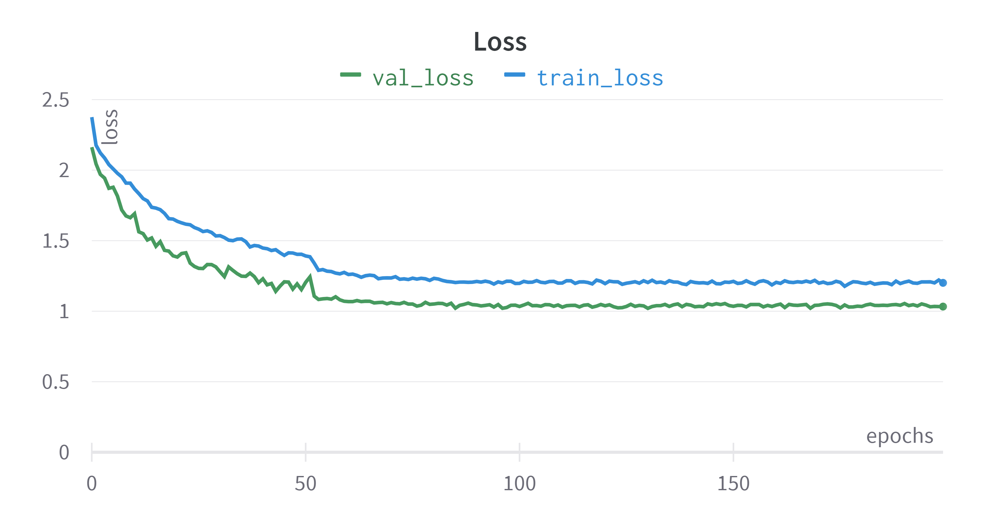
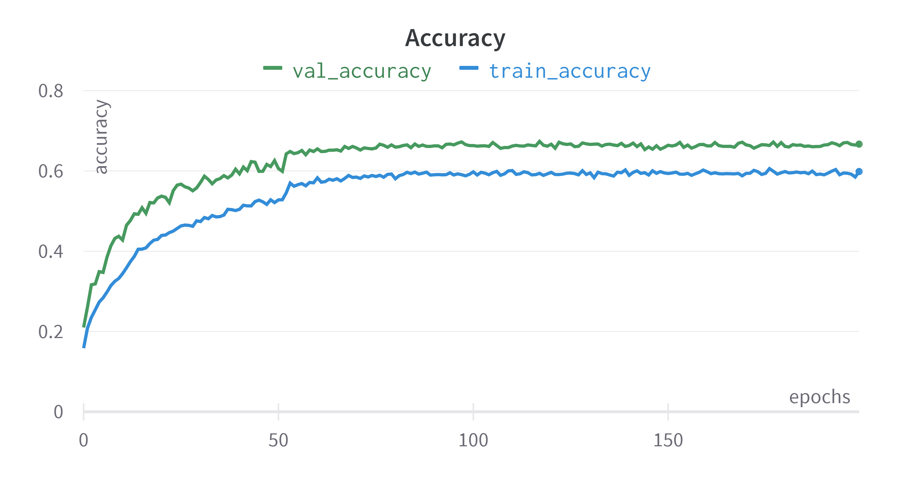
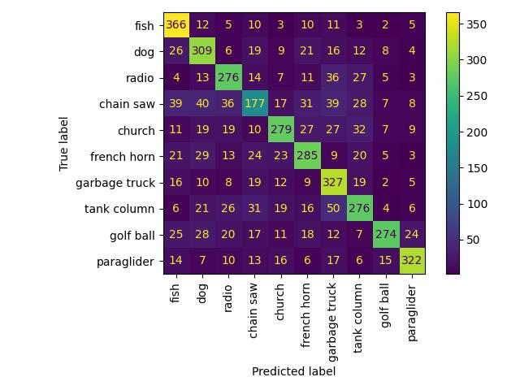

# Vision-Transformer

This repo contains my Vision-Transformer implementation. You can train the model yourself after you have downloaded the [dataset](https://github.com/fastai/imagenette). You can use my download script `download_dataset.sh` which will create a `data` directory. Sometimes Pytorch causes problems with the `requirements.txt`. If thats the case for you, simply delete the torch, torchvision and torchaudio lines in the `requirements.txt` and use the install command from their [website](https://pytorch.org/get-started/locally/).

```
./download_dataset.sh
python3 -m venv .env
source .env/bin/activate 

# maybe delete torch, torchvision and torchaudio and install them seperately
# e.g. pip3 install torch torchvision torchaudio --extra-index-url https://download.pytorch.org/whl/cu113

pip install -r requirements.txt 

python train.py 
```
You should take a look at the `config.py` if you want to change any hyperparameters.


## Results

After 200 epochs of training the basic Vision Transformer we reach the results you can see down below. I think for such a small dataset this is absolutely okay.

### Loss 



### Accuracy



### Confusion Matrix



Feel free to clone this and beat me ;)

# References 

* [Paper](https://arxiv.org/pdf/2010.11929.pdf)


# TODOs 

* add bash script to download imagenette 
* run multiple experiments with different hyperparameter combinations 
* add multi-gpu support 
* write down some stuff about the model here 
* provide a download-link to a trained model 
* instead of using the Pytorch Transformer Encoder blocks, implement them from scratch (for learning)
* research and try some tricks to improve performance on small datasets like this 
